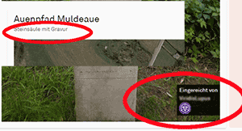

# Wayfarer Extension Scripts

Tools and scripts for Niantic Wayfarer

## What is it?
Userscripts for [NIANTIC WAYFARER](https://wayfarer.nianticlabs.com/)
> Userscript manager such as [Tampermonkey](https://tampermonkey.net/) required!
> Report bugs and/or feature requests in the [Issue Tracker](https://github.com/AlterTobi/Wayfarer-Extension-Scripts/issues)

## How to install / use?
Install [WFES Base](https://github.com/AlterTobi/WFES/raw/main/wfes-base.user.js) first!
> **It's required for all other scripts to work.**

## List of scripts
* [showcase](https://github.com/AlterTobi/WFES/raw/main/wfes-showcase.user.js)
    - shows wayspot description and the game used for submitting
    

## Developer documentation
Documentation for devs is available in the [Wiki](https://github.com/AlterTobi/Wayfarer-Extension-Scripts/wiki/WFES-Base).
Pull-Requests welcome - please use the dev-branch.