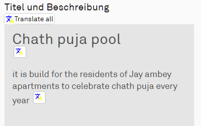

# Übersetzungstools

## Add Translation Button
Fügt eine Schaltfläche im Kopf der Seite zum Übersetzen aller Texte hinzu

* [Download](wfes-AddTranslationButtons.user.js)

## Google Translate
Die "alte" Version des Tools, mit Schaltflächen an allen Texten

* [Download](wfes-AddTranslationButtonsGoogle.user.js)

## Deepl Translate
wie Google, aber mit Deepl als Übersetzer

* [Download](wfes-AddTranslationButtonsDeepl.user.js)

---

[zurück zur Übersicht](../deutsch.html)