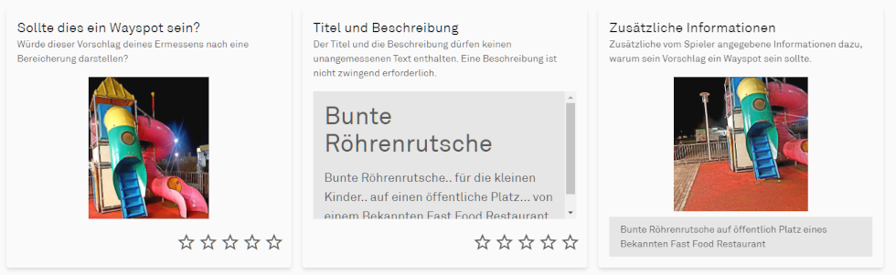
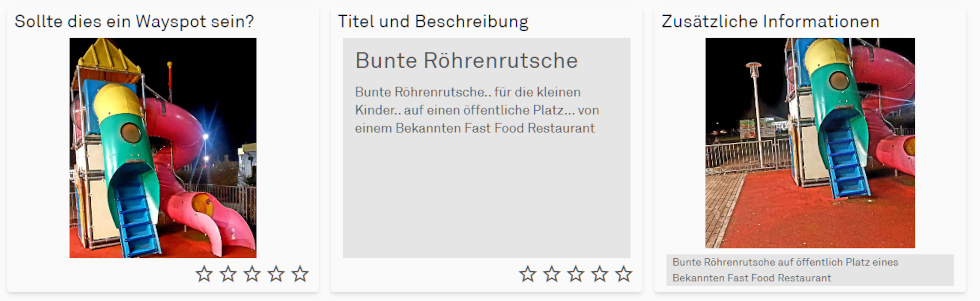

# CSS modifications

This script modifies some CSS settings to adjust the layout of the review page.
For example, tiles and images are enlarged, unnecessary blank spaces are removed, font sizes are changed, etc.
In addition to my own ideas, I also use styles from [Coal Train on Discord](https://discord.com/channels/639640865249165343/1083185495586111498).
However, you save yourself the trouble of setting up an additional extension.

## Important note

In addition to the size adjustments, I also hide the explanatory texts for the individual categories. I think experienced reviewers do not need this information anymore. If you do, please do not use this script.

This is what the original looks like:

After the modifications, it looks like this:

## Download

If you have read and understood all instructions and have installed the [base script](../wfes-Base.user.js), you can [install this script](../wfes-reviewImproveCSS.user.js).

---

[back to overview](../english.html)