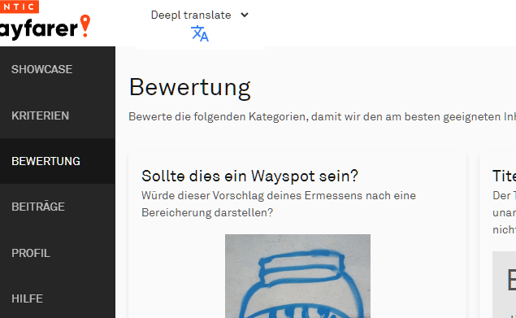
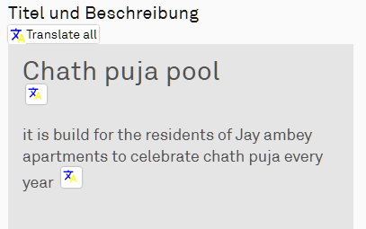
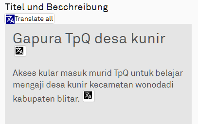

# Translation tools

## Add Translation Button
Adds a translate button to the page header

* [Download](wfes-AddTranslationButtons.user.js)

## Google Translate
the "old" version of thid tool with buttons near all texts

* [Download](wfes-AddTranslationButtonsGoogle.user.js)

## Deepl Translate
like "Google", but with Deepl translation engine

* [Download](wfes-AddTranslationButtonsDeepl.user.js)

---

[zurück zur Übersicht](../deutsch.html)