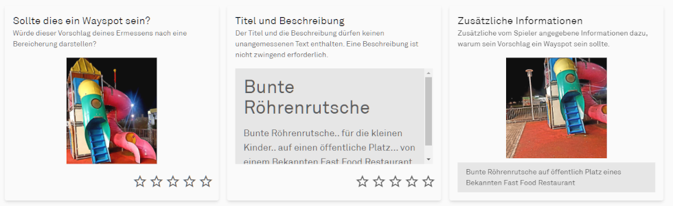
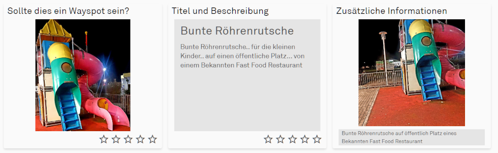

# CSS Modifikationen

Dieses Skript modifiziert einige CSS-Einstellungen um das Layout der Bewertungsseite anzupassen.
Dabei werden z.b. die Kacheln und Bilder vergößert, unnütze Leerräume entfernt, Schriftgrößen geändert usw.
Neben eigenen Ideen greife ich dazu auf Styles von [Coal Train auf Discord](https://discord.com/channels/639640865249165343/1083185495586111498)
zurück. Ihr spart euch aber das Einrichten einer zusätzlichen Erweiterung.

## wichtiger Hinweis

Neben den Größenanpassungen blende ich auch die Erklärungstexte zu den einzelnen Kategorien aus. Ich denke, erfahrene Reviewer benötigen
diese Informationen nicht mehr. Falls doch, benutze dieses Skript bitte nicht.

So sieht das Original aus:

Nach den Modifikationen ergibt sich folgendes Aussehen:

## Download

Wenn du alle Hinweise gelesen und verstanden sowie das [Basis-Skript](../wfes-Base.user.js) installiert hast, kannst du dieses Skript [installieren](../wfes-reviewImproveCSS.user.js).

---

[zurück zur Übersicht](../deutsch.html)