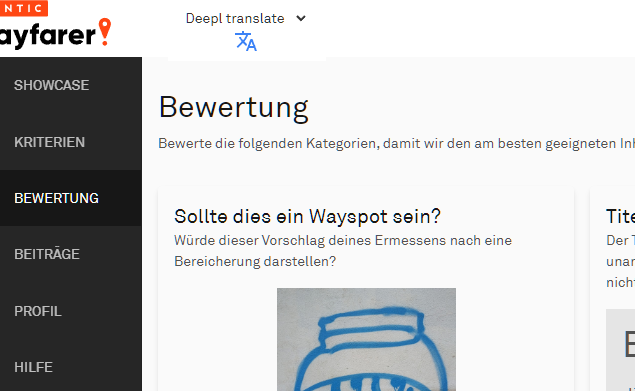

# Übersetzungstools

## Add Translation Button
Fügt eine Schaltfläche im Kopf der Seite zum Übersetzen aller Texte hinzu. Wähle zwischen Google und Deepl.

* [Download](../wfes-AddTranslationButtons.user.js)

---

## veraltete Scripte

Diese Scripte werden nicht mehr unterstützt und machen Probleme mit dem neuesten Wayfarer-Update.

### Google Translate
Die "alte" Version des Tools, mit Schaltflächen an allen Texten

* [Download](../wfes-AddTranslationButtonsGoogle.user.js)

### Deepl Translate
wie Google, aber mit Deepl als Übersetzer

* [Download](../wfes-AddTranslationButtonsDeepl.user.js)

---

[zurück zur Übersicht](../deutsch.html)